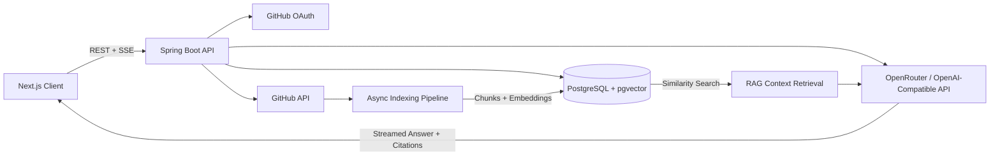
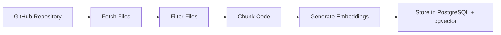

# Devxpert Backend

> An AI-powered backend for exploring GitHub repositories with codebase-aware, source-grounded AI responses.

Devxpert is an AI-powered developer workspace that allows engineers to connect GitHub repositories, index their codebases, and ask questions about their code with source-aware answers.

This repository contains the **Devxpert backend service**. It provides GitHub OAuth authentication, repository synchronization, asynchronous code indexing, retrieval-augmented generation (RAG), vector search, and streamed AI responses using Server-Sent Events (SSE).

---

## ✨ Why Devxpert?

### 🧠 Codebase-Aware AI

Repository files are filtered, chunked, embedded, and stored using PostgreSQL with pgvector for semantic retrieval.

### 📚 Grounded Responses

Chat requests retrieve relevant code context and return citations pointing back to repository files.

### ⚡ Asynchronous Indexing

Repository indexing runs in the background while indexing progress, completion state, and failures remain visible through the API.

### 🔐 GitHub-Native Access

Users authenticate with GitHub OAuth, and the backend synchronizes repositories available through the granted GitHub permissions.

### 🛡️ Secure Token Handling

GitHub access tokens are encrypted before being persisted.

### 🚀 Production-Minded API Design

The backend includes:

* Authenticated REST endpoints
* Request validation
* Centralized exception handling
* CORS configuration
* Spring Boot Actuator support
* Server-Sent Event (SSE) streaming

---

# 🏗️ Architecture



---

## 🔄 Request and Indexing Flow

1. A user signs in using GitHub OAuth.
2. The backend synchronizes repositories available to that user.
3. The user starts indexing a repository.
4. The asynchronous indexer:

   * Reads eligible files from GitHub
   * Filters unsupported or oversized files
   * Creates overlapping code chunks
   * Generates embeddings
   * Stores vectors in PostgreSQL using pgvector
5. A chat request retrieves the most relevant chunks.
6. The backend builds a constrained RAG prompt.
7. The AI response is streamed back to the client using Server-Sent Events (SSE).
8. The response includes citations pointing to relevant repository files.

---

# 🛠️ Technology Stack

| Area              | Technology                                              |
| ----------------- | ------------------------------------------------------- |
| **Language**      | Java 21                                                 |
| **Framework**     | Spring Boot 4.1.1                                       |
| **API**           | Spring Web MVC, REST, Server-Sent Events                |
| **Security**      | Spring Security, GitHub OAuth 2.0, Server-Side Sessions |
| **Persistence**   | Spring Data JPA, Hibernate, PostgreSQL                  |
| **Vector Search** | Spring AI PGVector, HNSW Index, Cosine Distance         |
| **AI**            | Spring AI 2.0.1                                         |
| **AI Provider**   | OpenRouter / OpenAI-Compatible API                      |
| **Build Tool**    | Maven Wrapper                                           |
| **Validation**    | Jakarta Bean Validation                                 |
| **Utilities**     | Lombok                                                  |
| **Operations**    | Spring Boot Actuator                                    |
| **Testing**       | JUnit                                                   |

---

# 📁 Project Structure

```text
src/main/java/devxpert/backend/

├── config/
│   ├── Application configuration
│   ├── CORS configuration
│   ├── Security configuration
│   └── Token encryption configuration
│
├── controller/
│   ├── Authentication endpoints
│   ├── Repository endpoints
│   └── Chat endpoints
│
├── dto/
│   └── Validated request and response contracts
│
├── entity/
│   ├── Users
│   ├── Repositories
│   ├── Chat sessions
│   ├── Messages
│   └── Repository indexing state
│
├── exception/
│   ├── Domain exceptions
│   └── Global exception handling
│
├── repository/
│   └── Spring Data persistence interfaces
│
├── security/
│   ├── Current-user access
│   └── GitHub OAuth integration
│
└── service/
    ├── ai/
    │   ├── Prompt construction
    │   ├── Context retrieval
    │   ├── AI streaming
    │   └── Citation mapping
    │
    ├── github/
    │   ├── GitHub API access
    │   └── Rate limiting
    │
    └── indexing/
        ├── File filtering
        ├── Code chunking
        └── Asynchronous indexing
```

---

# 📋 Prerequisites

Before running the project, make sure you have:

* Java 21
* Docker Desktop
* Docker Compose
* A GitHub OAuth App
* An OpenRouter API key or another OpenAI-compatible API provider

---

# 🚀 Quick Start

## 1. Clone the Repository

```bash
git clone <your-repository-url>
cd Devxpert-Backend
```

---

## 2. Start PostgreSQL and pgvector

From the repository root:

```bash
docker compose up -d postgres
```

The included Docker Compose configuration starts:

```text
pgvector/pgvector:pg16
```

PostgreSQL is exposed locally on:

```text
localhost:5433
```

---

## 3. Configure Environment Variables

Configure the following environment variables in your shell, IDE, or secret manager.

```text
DB_URL=jdbc:postgresql://localhost:5433/devxpert
DB_USERNAME=postgres
DB_PASSWORD=postgres

OPENROUTER_API_KEY=your-openrouter-key

GITHUB_CLIENT_ID=your-github-oauth-client-id
GITHUB_CLIENT_SECRET=your-github-oauth-client-secret

FRONTEND_URL=http://localhost:3000
CORS_ALLOWED_ORIGINS=http://localhost:3000

TOKEN_ENCRYPTOR_PASSSWORD=replace-with-a-long-random-value
TOKEN_ENCRYPTOR_SALT=replace-with-a-random-salt
```

> **Note**
>
> The property name `TOKEN_ENCRYPTOR_PASSSWORD` intentionally matches the existing application configuration.

For non-local environments, always provide the encryption password and salt through:

* Environment variables
* A secret manager
* A secure deployment configuration

Do not commit production secrets to source control.

---

## 4. Configure GitHub OAuth

Create a GitHub OAuth application and configure the callback URL as:

```text
http://localhost:8080/login/oauth2/code/github
```

The application should request the following scopes:

```text
read:user
repo
```

These permissions are used to authenticate the user and synchronize accessible repositories.

---

## 5. Run the Backend

From the `Devxpert-Backend` directory:

```bash
./mvnw spring-boot:run
```

### Windows

For PowerShell or Command Prompt:

```powershell
.\mvnw.cmd spring-boot:run
```

The API will start at:

```text
http://localhost:8080
```

---

# 🔌 API Overview

All `/api/**` endpoints require an authenticated GitHub session unless otherwise stated.

| Method | Endpoint                               | Description                                     |
| ------ | -------------------------------------- | ----------------------------------------------- |
| `GET`  | `/api/auth/login-url`                  | Returns the GitHub OAuth login path             |
| `GET`  | `/api/auth/me`                         | Returns the current authenticated user          |
| `GET`  | `/api/repos?refresh=true`              | Synchronizes and lists accessible repositories  |
| `GET`  | `/api/repos/{id}`                      | Returns a repository owned by the current user  |
| `POST` | `/api/repos/{id}/index`                | Starts asynchronous repository indexing         |
| `GET`  | `/api/repos/{id}/status`               | Returns repository indexing progress and status |
| `POST` | `/api/chat/sessions`                   | Creates a chat session for a repository         |
| `GET`  | `/api/chat/sessions?repositoryId={id}` | Lists chat sessions for a repository            |
| `GET`  | `/api/chat/sessions/{id}`              | Loads messages for a chat session               |
| `POST` | `/api/chat/sessions/{id}/messages`     | Streams an AI response using SSE                |
| `POST` | `/api/auth/logout`                     | Invalidates the current session                 |

---

# 📦 Repository Indexing

## Start Indexing

```bash
curl -X POST http://localhost:8080/api/repos/{repository-id}/index \
  -H "Cookie: DEVXPERT_SESSION=<authenticated-session>"
```

The endpoint returns immediately with:

```text
202 Accepted
```

Indexing continues asynchronously in the background.

Use the repository status endpoint to monitor progress:

```text
GET /api/repos/{id}/status
```

---

## Indexing Pipeline

The indexing pipeline performs the following steps:



The pipeline is designed to:

* Skip unsupported file types
* Skip oversized files
* Chunk files with overlap
* Process embeddings in batches
* Limit memory usage
* Reduce AI API pressure
* Continue indexing when individual files fail

Existing vectors are removed before re-indexing so stale repository context is not mixed with newly indexed code.

---

# 💬 Chat and RAG

When a user sends a message:

```text
User Question
      │
      ▼
Semantic Retrieval
      │
      ▼
Relevant Code Chunks
      │
      ▼
Constrained RAG Prompt
      │
      ▼
AI Provider
      │
      ▼
Streaming Response
      │
      ▼
Answer + Repository Citations
```

The backend retrieves relevant code chunks from PostgreSQL using vector similarity search.

The retrieved context is used to build a constrained prompt so responses are grounded in the indexed repository rather than relying only on the model's general knowledge.

---

# 🌊 Streaming Chat Responses

Chat responses are streamed using:

```text
Content-Type: text/event-stream
```

Example request:

```bash
curl -N -X POST \
  http://localhost:8080/api/chat/sessions/{session-id}/messages \
  -H "Content-Type: application/json" \
  -H "Cookie: DEVXPERT_SESSION=<authenticated-session>" \
  -d '{"content":"Where is authentication configured?"}'
```

The `-N` flag disables output buffering so streamed events are displayed as they arrive.

---

# ⚙️ Configuration Reference

| Variable                    | Default                                     | Description                            |
| --------------------------- | ------------------------------------------- | -------------------------------------- |
| `DB_URL`                    | `jdbc:postgresql://localhost:5433/devxpert` | PostgreSQL JDBC connection URL         |
| `DB_USERNAME`               | `postgres`                                  | PostgreSQL username                    |
| `DB_PASSWORD`               | `postgres`                                  | PostgreSQL password                    |
| `OPENROUTER_API_KEY`        | Required                                    | API key used for chat and embeddings   |
| `GITHUB_CLIENT_ID`          | Local fallback exists                       | GitHub OAuth client ID                 |
| `GITHUB_CLIENT_SECRET`      | Local fallback exists                       | GitHub OAuth client secret             |
| `FRONTEND_URL`              | `http://localhost:3000`                     | Frontend OAuth redirect destination    |
| `CORS_ALLOWED_ORIGINS`      | `http://localhost:3000`                     | Allowed browser origins                |
| `TOKEN_ENCRYPTOR_PASSSWORD` | Development fallback                        | Password used to encrypt GitHub tokens |
| `TOKEN_ENCRYPTOR_SALT`      | Development fallback                        | Salt used by the token encryptor       |

Additional indexing controls are available in `application.properties`, including:

* Maximum file size
* Chunk size
* Chunk overlap
* Embedding batch size
* GitHub API delay

---

# 🧪 Development Commands

## Run Tests

```bash
./mvnw test
```

## Build the Application

```bash
./mvnw clean package
```

## Run the Packaged JAR

```bash
java -jar target/backend-0.0.1-SNAPSHOT.jar
```

### Windows

Replace:

```text
./mvnw
```

with:

```text
.\mvnw.cmd
```

---

# 🔒 Security Notes

The backend uses several security mechanisms to protect user access and credentials.

### GitHub OAuth

Users authenticate using GitHub OAuth 2.0.

### Server-Side Sessions

Authenticated requests use server-side sessions.

### Encrypted Access Tokens

GitHub access tokens are encrypted before being stored.

### Session Cookies

Session cookies are configured with:

```text
HttpOnly
SameSite=Lax
```

---

## Production Recommendations

Before deploying to production, configure:

* HTTPS
* Secure cookies
* Secret rotation
* A production-grade session store
* Restricted CORS origins
* Managed database backups
* Rate limiting
* Monitoring and alerting
* Controlled database migrations

---

# 🗄️ Database Notes

PostgreSQL must have the `vector` extension enabled.

The repository includes an initialization script:

```text
docker/postgres/init-extensions.sql
```

The Docker Compose setup runs this script automatically when the database is initialized for the first time.

For local development, the application currently uses:

```text
spring.jpa.hibernate.ddl-auto=update
```

This is convenient during development but should be replaced with managed database migrations and a controlled schema strategy for production deployments.

---

# 🧪 Testing

The project currently includes a Spring application context smoke test.

Run the test suite with:

```bash
./mvnw test
```

Future integration tests should use:

* Isolated PostgreSQL databases
* pgvector-enabled test environments
* Mocked GitHub API clients
* Mocked AI providers

This keeps external credentials and network dependencies out of CI.

---

# 🖥️ Related Project

The Devxpert frontend is built with Next.js and lives in the sibling:

```text
client/
```

directory.

During local development, the frontend communicates with this backend at:

```text
http://localhost:8080
```

---


## ⭐ Devxpert

Devxpert helps developers understand unfamiliar codebases faster by combining:

* GitHub repository access
* Automated code indexing
* Semantic vector search
* Retrieval-Augmented Generation
* Source-aware AI responses
* Streaming chat experiences

Built for developers who want to spend less time searching through code and more time building.
